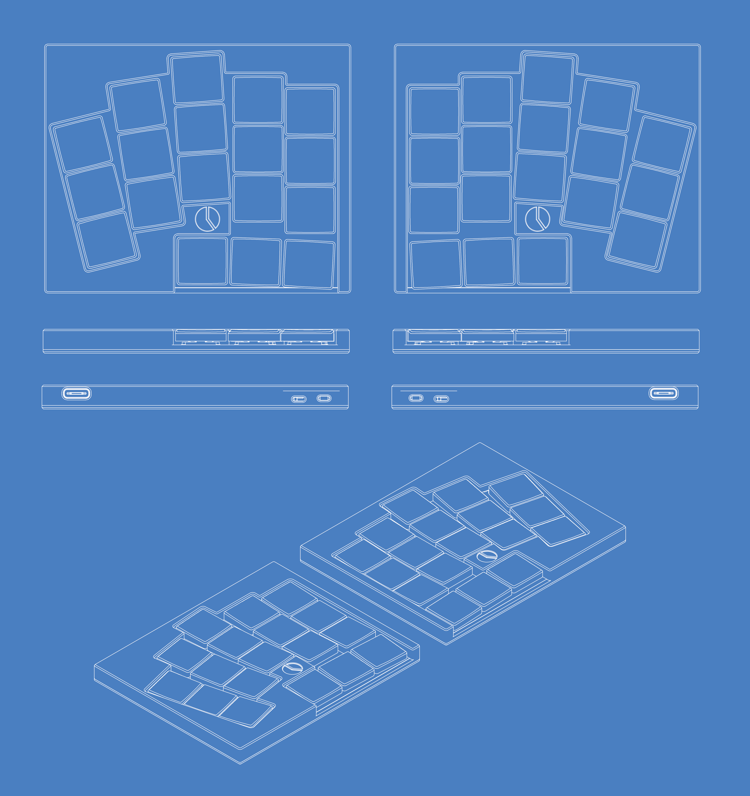
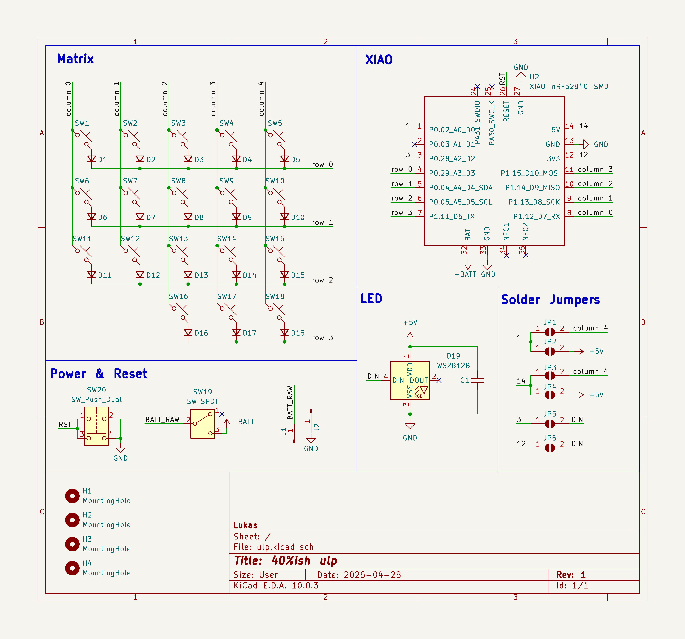
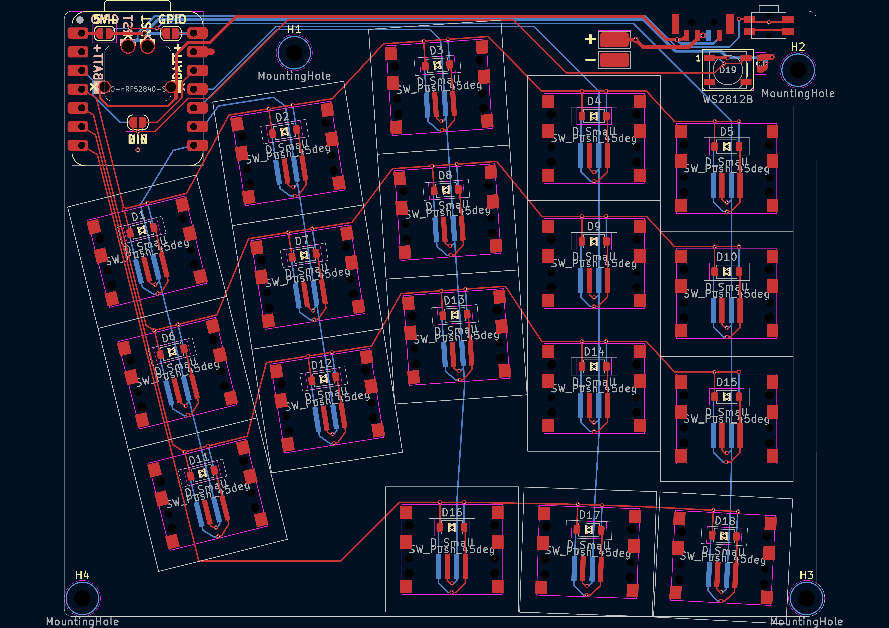
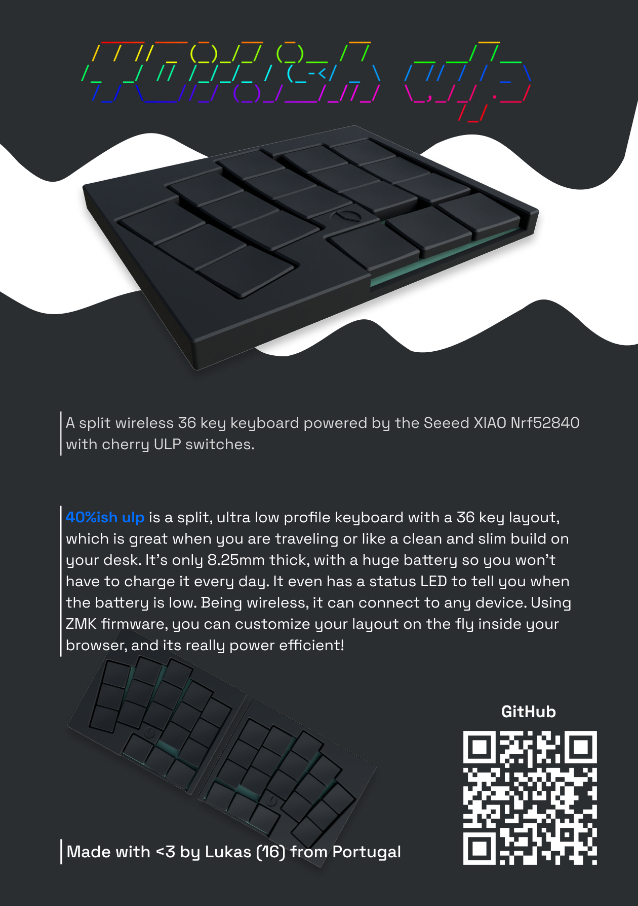

# 40%ush ULP

> A split wireless 36 key keyboard powered by the Seeed XIAO Nrf52840 with cherry ULP switches.

  

  

  

---

**40%ish** ulp is a split, ultra low profile keyboard with a 36 key layout, which is great when you are traveling or like a clean and slim build on your desk. It's only 8.25mm thick, with a huge battery so you won't have to charge it every day. It even has a status LED to tell you when the battery is low. Being wireless, it can connect to any device. Using ZMK firmware, you can customize your layout on the fly inside your browser, and its really power efficient!

---

## Features

- 36 key split layout
- Wireless BLE with ZMK
- Cherry ULP switches
- Reversible PCB design

---

## BOM
 
| Part | Qty | Specification | Price | Link |
|------|-----|---------------|-------|------|
| MCU | 2 | Seeed XIAO nRF52840 | $26.18 | [mauser.pt](https://mauser.pt/095-1482/seeed-102010448-microcontrolador-seeed-studio-xiao-nrf52840-c-bluetooth-5-0-ble-nfc-e-carregamento-de-bateria) |
| Switches (pack of 10) | 4 | Cherry ULP | $41.63 | [keeb.supply](https://keeb.supply/products/cherry-mx-ulp?variant=a840d9fa-f4e0-4218-be04-4d0f5e8f7554) |
| PCBs | 5 | Reversible, MOQ 5 | $11.06 | [jlcpcb.com](https://jlcpcb.com) |
| Batteries | 2 | Filament powder 1200 | N/A | N/A |
| Diodes | 36 | SOD-123 | $1.57 | [aliexpress.com](https://pt.aliexpress.com/item/1005012163356976.html) |
| Power Switch | 2 | MK-12C02 | $0.87 | [aliexpress.com](https://pt.aliexpress.com/item/1005011530988236.html) |
| Reset Switch | 2 | EVQ-PUL02K | $1.87 | [aliexpress.com](https://pt.aliexpress.com/item/1005010726427079.html) |
| LEDs | 2 | WS2812B | $1.14 | [aliexpress.com](https://pt.aliexpress.com/item/1005008739048100.html) |
| Case | 2 | | $6.42 | [jlc3dp.com](https://jlc3dp.com) |
| Keycaps | 36 | Resin Printed | $37.46 | [jlc3dp.com](https://jlc3dp.com) |
| Magnets | 8 | 5x2mm round magnets | $2.88 | [aliexpress.com](https://pt.aliexpress.com/item/1005009605352565.html) |
| **Total** | | | **$131.08** | |

---

## Pictures

| |
|:---:|
| **Blueprint**   |
| **Schematic**   |
| **PCB**   |
| **Zine**   [Full PDF](images/zine.pdf) |

